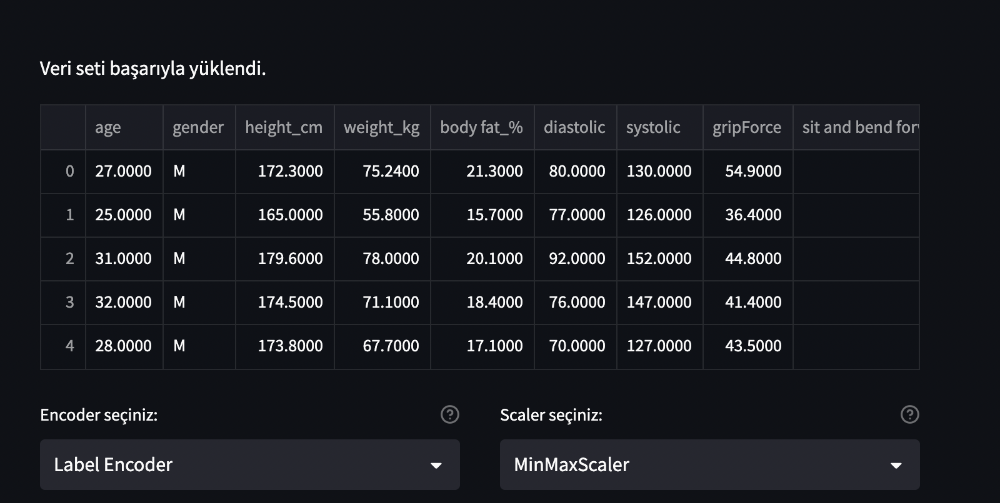
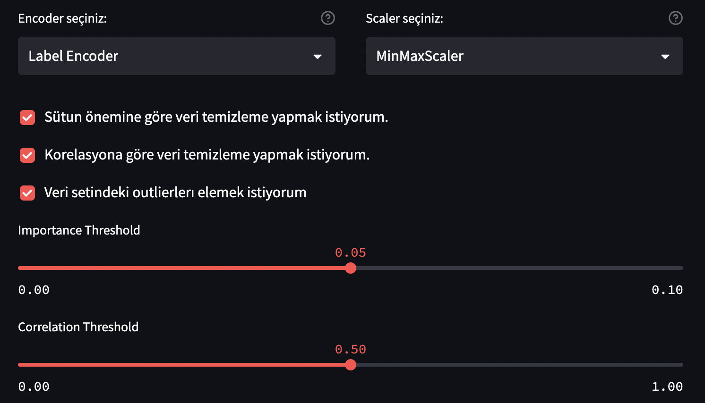
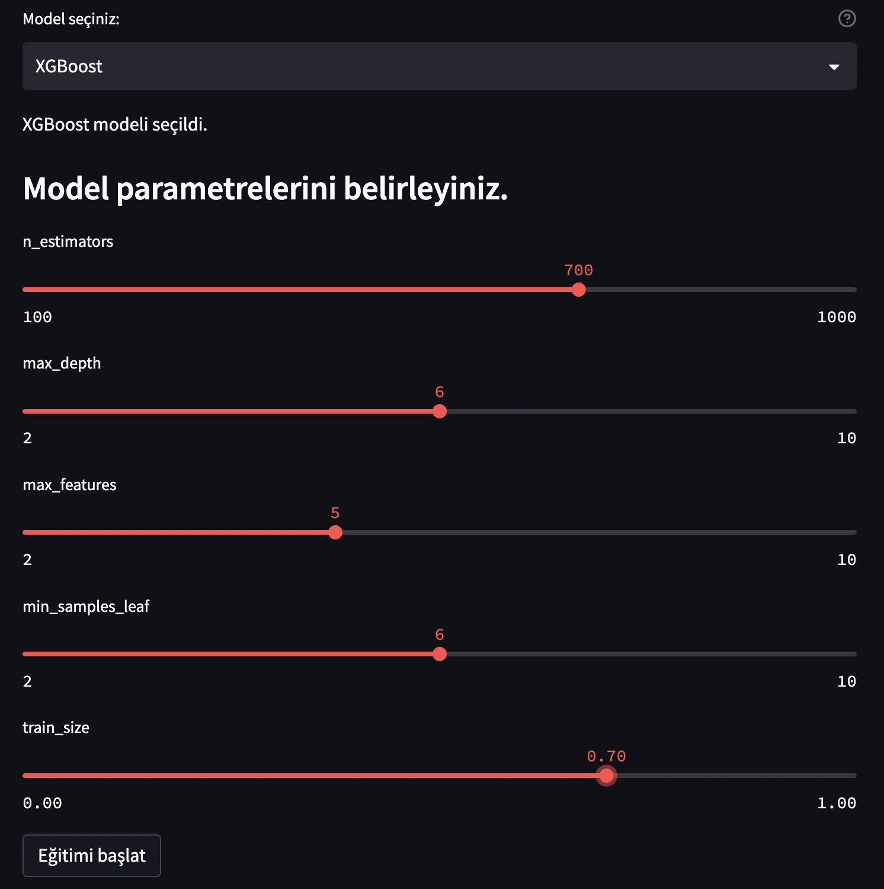
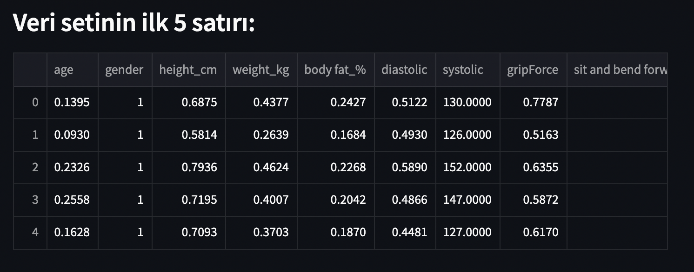
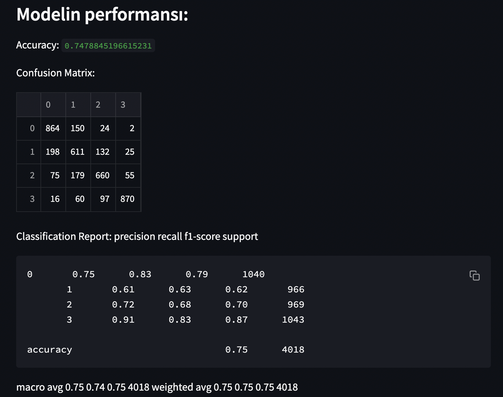
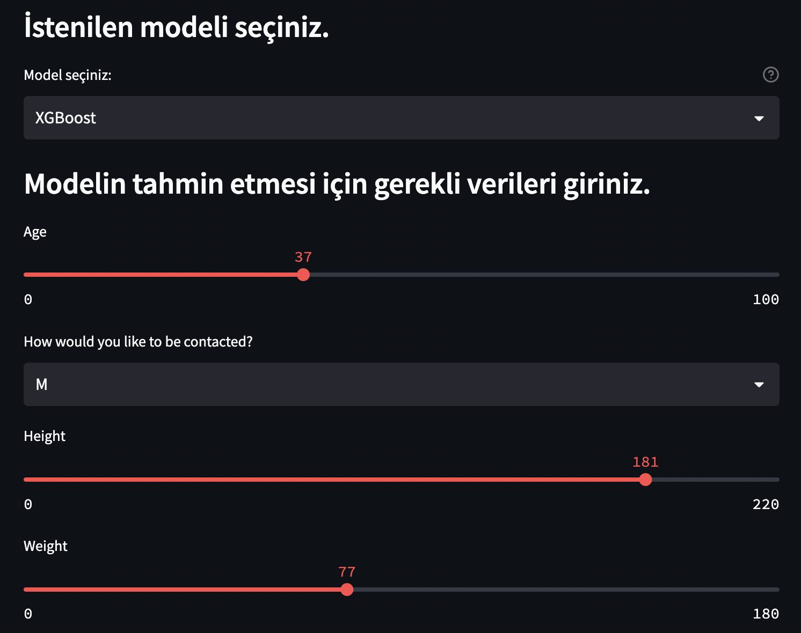
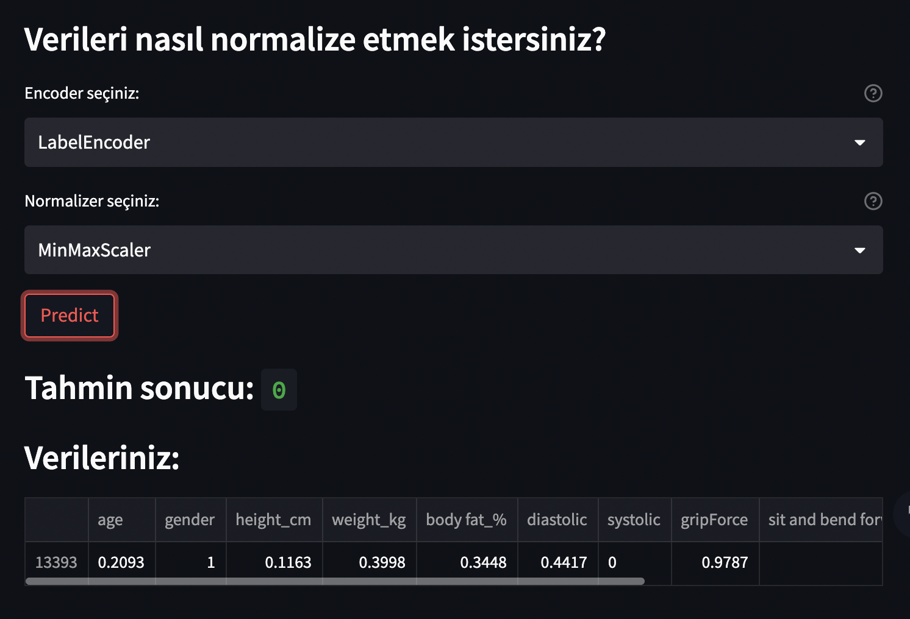

# Streamlit Sample Project for ML

Basic ML Training and Testing UI Desing with Streamlit

### Install Requirements

```bash
pip install -r requirements.txt
```

### To run training

```bash
streamlit run train.py
```

### To run single test

```bash
streamlit run test.py
```

## UI Designs

Loading Data



Select Encoder Scaler and Preprocessing Steps and Parametrs



Select Model and Model Parametrs



Show Preprocessed Data



Show Training Results




## Single Sample Testing

Load Model and Give İnputs



Select Same Encoder and Scaler and Predict 



